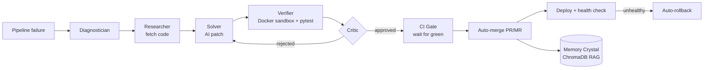

# 🛠️ Opalite — CI/CD Self-Healing Agent

An autonomous agent that **detects a broken CI/CD pipeline, fixes the code with AI, verifies the fix in a sandbox, gates it on real CI, merges it, and deploys it live — with automatic rollback if the deploy is unhealthy.** No human in the loop.

Works with **GitHub** and **GitLab**. Users log in with their own account and connect the repos they want the agent to watch.

---

## ✨ What makes it different

Automated CI/CD isn't new. What's uncommon is the **complete autonomous loop**, end to end:

```
failure detected → AI diagnosis → AI fix → sandbox verification → CI gate
      → auto-merge → live deploy → health check → auto-rollback
```

Every step is gated on real evidence — the agent never ships a fix that fails its own tests or the platform's CI.

---

## 🚀 Features

- **Multi-agent healing pipeline** (LangGraph): Diagnostician → Researcher → Solver → Verifier → Critic → Deployer, with a self-correcting loop (the Critic feeds failures back to the Solver).
- **Real sandbox verification** — the proposed patch is applied and `pytest` is run inside a **Docker container** (with a host fallback) *before* any PR is opened. LLM-generated code never ships unverified.
- **CI-gated auto-merge** — the agent waits for the fix branch's **real CI checks** (GitHub Actions / GitLab pipelines) to go green before merging.
- **Self-bootstrapping pipelines** — if a repo has no CI/CD, the agent installs a full pipeline itself (`lint → test+coverage → security scan → build → deploy`) as part of the fix.
- **Agent-as-deployer** — after merge, the agent runs the healed app locally and exposes it via a single **ngrok** tunnel, returning a live URL. (Also supports GitHub Actions `deploy.yml` and deploy webhooks.)
- **Auto-rollback** — a failed post-deploy health check reverts the last commit and redeploys the last good version.
- **Long-term memory (RAG)** — successful fixes are embedded into a **ChromaDB** vector store and retrieved for similar future failures.
- **Repo-aware chatbot** — ask questions about a selected repo; answers are grounded in its actual code and formatted as clean bullet points.
- **Login with GitHub or GitLab** — OAuth; the token is stored server-side only (httpOnly session cookie), never exposed to the browser.

---

## 🧠 Architecture



---

## 🧩 Tech stack

| Layer | Technology |
|---|---|
| Backend / API | Python, FastAPI, Uvicorn, Server-Sent Events |
| Agent orchestration | LangGraph, LangChain |
| LLM | Groq LPU — Llama 3.3 70B |
| Memory (RAG) | ChromaDB + embeddings |
| Sandbox | Docker (host fallback), pytest |
| SCM integration | GitHub REST API, GitLab v4 API (via HTTPX) |
| Deploy | Agent-as-deployer + ngrok, GitHub Actions, deploy webhooks |
| Frontend | Vanilla JS, Tailwind (CDN), marked.js, highlight.js |

---

## 📁 Project structure

```
backend/
├── main.py                    # FastAPI app: OAuth, /heal, /rollback, /chat (SSE)
├── requirements.txt
├── .env.example
├── agent/
│   ├── graph.py               # LangGraph state machine
│   ├── nodes.py               # the agent nodes
│   ├── state.py               # shared AgentState
│   ├── context_builder.py     # log/error-trace trimming
│   └── tools/
│       ├── github_service.py  # GitHub API (PRs, checks, merge, rollback)
│       ├── gitlab_service.py  # GitLab API (MRs, pipelines, merge, revert)
│       ├── test_runner.py     # Docker/host sandbox verifier
│       ├── memory_crystal.py  # ChromaDB vector memory (RAG)
│       ├── deployer.py        # agent-as-deployer (local + ngrok)
│       └── cicd_templates.py  # auto-installed CI/CD pipelines
├── templates/index.html       # dashboard UI
└── static/styles.css
.github/workflows/             # reference CI + deploy pipelines
presentation/                  # pitch / architecture docs
```

---

## ⚙️ Setup

### 1. Prerequisites
- Python 3.11+
- (Optional) Docker Desktop — for the containerized sandbox (falls back to host if absent)
- (Optional) ngrok — for live deployments
- A [Groq API key](https://console.groq.com/keys)

### 2. Install
```bash
cd backend
pip install -r requirements.txt
```

### 3. Register OAuth apps

**GitHub** — https://github.com/settings/developers → *New OAuth App*
- Homepage URL: `http://localhost:8000`
- Callback URL: `http://localhost:8000/auth/github/callback`

**GitLab** (optional) — https://gitlab.com/-/profile/applications
- Redirect URI: `http://localhost:8000/auth/gitlab/callback`
- Scopes: `api`

### 4. Configure `.env`
```bash
cp .env.example .env
```
Fill in `GROQ_API_KEY`, the GitHub/GitLab client IDs + secrets. See `.env.example` for every option (CI gate timeout, sandbox mode, deploy settings, etc.).

### 5. Run
```bash
python main.py
```
Open **http://localhost:8000**.

---

## 📖 Usage

1. **Log in** with GitHub or GitLab.
2. Click **Add / manage repositories** and connect the repos you want monitored.
3. Hover a repo → **AI Heal Repo** to run the full autonomous loop, or **Rollback** for an emergency revert.
4. Ask the **chatbot** about a repo — pick it in the *Repo context* dropdown; answers are grounded in its code.

### Live deployment (optional)
Start one ngrok tunnel on the deploy port (once):
```bash
ngrok http 5000 --domain=<your-permanent-domain>
```
Set `DEPLOY_ENABLED=true` in `.env`. After a verified merge, the agent deploys the healed app locally and returns the live URL. ngrok always points at the deploy port, so your permanent link always shows the latest healed version.

---

## 🔒 Security notes

- OAuth tokens live **server-side only**; the browser gets an opaque httpOnly session cookie.
- The sandbox runs untrusted, LLM-generated code inside **Docker** — keep `SANDBOX_MODE=docker` for anything public.
- ⚠️ If you expose the app publicly for multi-user testing, **containerize the deployer or set `DEPLOY_ENABLED=false`** — otherwise a logged-in stranger's app code would run on the host machine.
- Never commit `.env`. Only `.env.example` (placeholders) is tracked.

---

## 🗺️ Roadmap

- Jenkins connector (monitor builds, route fixes to the linked SCM)
- Containerized agent-deployer for safe public multi-user use
- Default-branch auto-detection (`main` / `master`)
- Slack/email notifications on heal & deploy events
